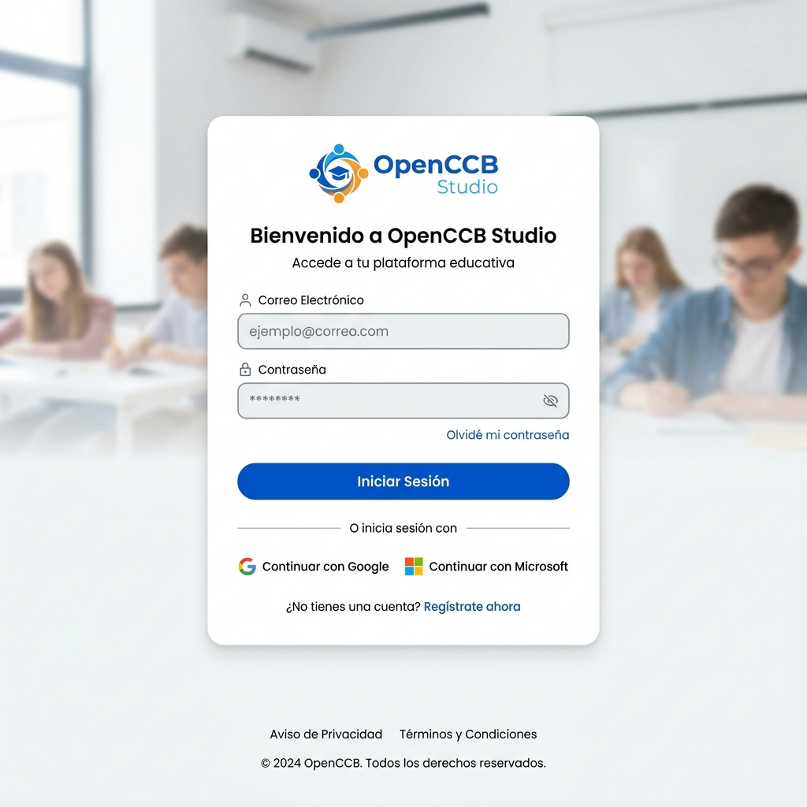

# Manual de Usuario - OpenCCB Studio
*Versión 1.0*

Bienvenido al manual de uso de **OpenCCB Studio**, el entorno de administración integral para gestionar el portal educativo. Aquí aprenderás a ingresar, navegar el panel de administración y gestionar las actividades.

---

## 1. Inicio de Sesión

Para acceder a OpenCCB Studio:
1. Abra su explorador web (se recomienda Google Chrome, Firefox o Edge).
2. Diríjase a la dirección URL de Studio (por ejemplo: `http://localhost:3000`).
3. En la pantalla de inicio, ingrese sus credenciales (**Email** y **Contraseña**).
4. Haga clic en **"Iniciar Sesión"**.

> [!NOTE]
> *[📸 INSERTA AQUÍ LA CAPTURA DE PANTALLA: Pantalla de Login]*
> *Nombre sugerido de la imagen para la ruta: `/home/juan/dev/openccb/docs/img/login.png`*
> 

---

## 2. Panel de Administrador (Dashboard)

Una vez iniciada la sesión, será redirigido al **Dashboard** o Panel de Control.
Este panel sirve como el corazón operativo de su plataforma:

*   **Menú Lateral:** En la parte izquierda, encontrará la navegación para acceder a Usuarios, Cursos, Organizaciones, Banco de Preguntas, y el Creador de Ejercicios.
*   **Resumen General:** La pantalla principal mostrará estadísticas rápidas de uso (total de alumnos inscritos, cursos activos, etc.).

> [!NOTE]
> *[📸 INSERTA AQUÍ LA CAPTURA DE PANTALLA: Dashboard Principal]*
> *Nombre sugerido de la imagen: `/home/juan/dev/openccb/docs/img/dashboard.png`*
> 

---

## 3. Tipos de Ejercicios y su Creación

OpenCCB Studio permite una gestión altamente detallada del contenido. A continuación se explican los distintos tipos de ejercicios que se pueden construir en la plataforma. 

Para crear cualquiera de ellos, diríjase a **"Banco de Preguntas"** o **"Actividades"** en el menú lateral y presione botón **"Crear Nueva"**.

### 3.1 Opción Múltiple (Multiple Choice)
Ejercicio estándar donde el estudiante debe elegir una única respuesta correcta (o varias, dependiendo de la configuración) de una lista de alternativas.

**Pasos para crearlo:**
1. Seleccione "Opción Múltiple" como Tipo de Ejercicio.
2. Complete el **Enunciado** de la pregunta.
3. Añada las alternativas haciendo clic en "Agregar Opción".
4. Marque con el selector ("Correct") la(s) opción(es) que es o son correctas.
5. Seleccione Guardar.

> [!NOTE]
> *[📸 INSERTA AQUÍ LA CAPTURA DE PANTALLA: Formulario de creación de "Multiple Choice"]*
> 

### 3.2 Verdadero / Falso (True/False)
Este ejercicio evalúa la veracidad de una afirmación o concepto.

**Pasos para crearlo:**
1. Seleccione "Verdadero o Falso".
2. Redacte la afirmación de la pregunta.
3. Marque la alternativa correcta, o bien "Verdadero", o bien "Falso".
4. Guarde los cambios.

> [!NOTE]
> *[📸 INSERTA AQUÍ LA CAPTURA DE PANTALLA: Formulario "Verdadero o Falso"]*
> 

### 3.3 Completar Espacios (Fill in the Blanks)
Este tipo de ejercicio es ideal para pruebas de lenguaje y gramática. El estudiante debe tippear la palabra exacta.

**Pasos para crearlo:**
1. Seleccione "Completar Espacio".
2. Escriba el texto principal e inserte marcadores donde desee que queden los huecos (por ejemplo: `___` o usando el formato del editor).
3. En el panel de respuestas, declare la palabra correcta para cada marcador.
4. Puede establecer opciones sensibles a mayúsculas/minúsculas si el módulo de IA lo avala.

> [!NOTE]
> *[📸 INSERTA AQUÍ LA CAPTURA DE PANTALLA: Configuracion Fill-in-the-blanks]*
> 

### 3.4 Arrastrar y Soltar (Drag & Drop)
Ejercicios interactivos donde el usuario asocia conceptos uniendo elementos.

**Pasos para crearlo:**
1. En configuración, defina los "Contenedores" o zonas destino (Targets).
2. Defina los "Elementos a arrastrar" (Items).
3. Establezca las relaciones lógicas indicando qué "Elemento" pertenece a qué "Contenedor" en la sección de respuestas (Mapping).

> [!NOTE]
> *[📸 INSERTA AQUÍ LA CAPTURA DE PANTALLA: Ejercicio Drag and Drop]*
> 

### 3.5 Respuesta Corta Abierta (Open Ended / AI Graded)
Con la funcionalidad de Inteligencia Artificial (LLM) de OpenCCB, es posible hacer preguntas de desarrollo donde el alumno escribe su respuesta y un modelo la califica bajo ciertos parámetros de rúbrica.

1. Seleccione "Respuesta Abierta".
2. Asigne la **Rúbrica de corrección** (ej. "La respuesta debe mencionar las causas de la Revolución Francesa. 0 puntaje si menciona factores incorrectos").
3. Determine el número máximo de palabras o la extensión requerida.
4. Elija si desea habilitar Voice-to-Text (Whisper) para responder usando el micrófono.

> [!NOTE]
> *[📸 INSERTA AQUÍ LA CAPTURA DE PANTALLA: Ejercicio Respuesta Abierta / VoiceToText]*
> 

---

## 4. Exportar a PDF desde este Documento
Como los prerrequisitos se instalaron usando el script `install.sh`, en su entorno puede ubicar la consola y ejecutar este comando dentro del directorio que contiene este archivo (`docs`):

```bash
# Convertir el manual Markdown a PDF
pandoc OpenCCB_Manual_Studio.md -o OpenCCB_Manual_Studio.pdf --pdf-engine=xelatex
```

*(Recuerde colocar las correspondientes imágenes simuladas o tomar las capturas desde su Studio antes en la carpeta `img`)*
